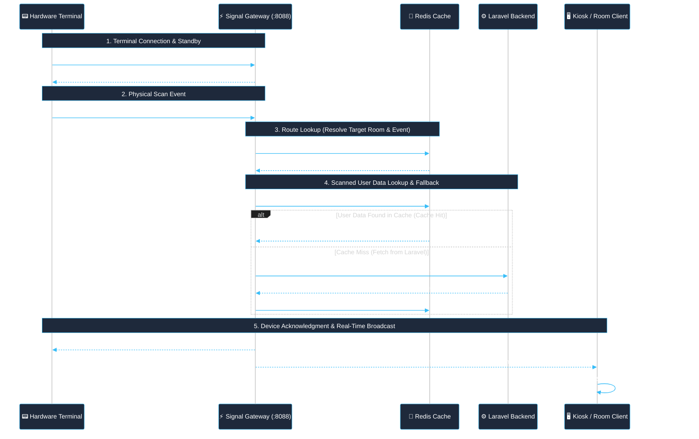

# Signal Service - Hardware Device Scan & Attendance Integration Guide

This guide details how to integrate biometric, RFID, and facial recognition terminals (e.g. AiFace hardware devices) with the **Signal Service** and **Laravel** application to enable automated access verification and instant real-time attendance broadcasting.

---

## 1. Architecture & Workflow Overview

The hardware integration operates via the dedicated **`HardwareGateway`** in `signal-service-api` (listening on raw WebSocket port `8088`, path `/pub/chat`). It coordinates between the physical device, Redis routing/user cache, the Laravel backend, and frontend display monitors.



### End-to-End Workflow Stages

1. **Terminal Connection & Standby**:
   - The hardware device connects first to the Signal Service via raw WebSocket on port `8088` (`/pub/chat`).
   - Signal registers the active device connection, and the terminal enters standby, awaiting user scans.

2. **Scan Event & Log Transmission**:
   - When a user scans (biometric face, fingerprint, or RFID card), the device packages the record into a JSON payload (`cmd: "sendlog"`) and transmits it over the open WebSocket to Signal.

3. **Redis Route Lookup (`projectId`, `appId`, `roomId`, `event`)**:
   - Signal queries Redis for the device's registered route configuration using the terminal serial number (`sn`).
   - Resolves target routing metadata: `{ projectId, appId, roomId, event }` to determine which project, application, room, and event name to emit to.

4. **User Data Lookup & Cache Fallback**:
   - Signal checks Redis for the scanned user's profile and access cache (`device:user:{sn}:{userId}`).
   - **Cache Hit**: Returns cached user profile instantly.
   - **Cache Miss**: Signal calls the Laravel backend (`POST /api/student/attendance/access-scan`) with internal authentication headers to retrieve the user's information and access decision. Once received, Signal caches the user data in Redis for subsequent scans.

5. **Terminal Acknowledgment (`ack`)**:
   - Signal sends an immediate acknowledgment response back to the hardware device socket so the terminal can provide visual screen feedback and sound cues (success chime for allowed, warning buzzer for denied).

6. **Real-Time Room Broadcast**:
   - Signal emits the message payload to the designated target room (`project:{projectId}:app:{appId}:room:{roomId}`) using the resolved `event`.
   - Connected frontend clients (e.g. `ScanAttendanceComponent.js` on live kiosk monitors or gate displays) receive the event and instantly update the DOM with the student's avatar, name, and timestamp.

---

## 2. Laravel Backend Verification API

When a user scans at a terminal, `signal-service-api` makes a direct HTTP POST request to Laravel to verify user access.

### 2.1 Route Definition (`routes/api.php`)

```php
use App\Http\Controllers\StudentAttendanceController;

Route::post('/student/attendance/access-scan', [StudentAttendanceController::class, 'checkAccessScan']);
```

### 2.2 Request Contract (Signal $\rightarrow$ Laravel)

- **Method**: `POST`
- **Endpoint**: `/api/student/attendance/access-scan`
- **Headers**:
  - `Content-Type: application/json`
  - `X-Internal-Secret: {INTERNAL_API_SECRET}`
- **Payload**:
```json
{
  "current_date": "2026-09-14",
  "present_time": "08:30",
  "user_id": "1052",
  "user_name": "Sokha Chan"
}
```

### 2.3 Response Contract (Laravel $\rightarrow$ Signal)

Laravel must return a JSON response with HTTP status 200, containing the `access` flag (`1` for allowed, `0` for denied) and an optional `reason`:

#### Approved Check-In Response:
```json
{
  "status_code": 200,
  "data": {
    "access": 1,
    "reason": "On-Time Check-In"
  }
}
```

#### Denied Access Response:
```json
{
  "status_code": 200,
  "data": {
    "access": 0,
    "reason": "Access Denied: Unenrolled or Suspended"
  }
}
```

---

## 3. Dedicated Kiosk Scan Ticket Route

Attendance display boards or walk-through kiosk monitors operating without standard user session logins authenticate through a dedicated scan ticket endpoint:

### 3.1 Route Definition (`routes/api.php`)

```php
use Illuminate\Http\Request;
use Illuminate\Support\Facades\Route;

Route::get('/scan-attendance-signal-ticket', function (Request $request) {
    // Dedicated app ID assigned for attendance display kiosks
    $appId     = '8AE496F4C88EB47721B5B202EBDBC546';
    $secret    = config('signal.signal_secret');
    $timestamp = (string) time();
    $projectId = config('signal.signal_project_id');
    $userId    = '1'; // Dedicated Kiosk / System User ID

    $signature = hash_hmac(
        'sha256',
        "{$appId}.{$timestamp}.{$projectId}.{$userId}",
        $secret
    );

    return response()->json(compact('appId', 'timestamp', 'projectId', 'userId', 'signature'));
});
```

---

## 4. Signal Broadcast Payload to Frontend

Once access is evaluated, Signal broadcasts the scan event to the mapped attendance room:

- **Target Room**: `project:{projectId}:app:{appId}:room:{roomId}`
- **Event Name**: As configured in device routing (e.g. `student_scanned` or `scan_attendance`)
- **Payload**:

```json
{
  "user_id": "1052",
  "user_name": "Sokha Chan",
  "device_sn": "AF8923019283",
  "status": "CHECK_IN",
  "reason": "On-Time Check-In",
  "verify_mode": 1,
  "current_date": "2026-09-14",
  "present_time": "08:30:15"
}
```

### Status Reference
| Status Value | Meaning | Action on Frontend |
|---|---|---|
| `CHECK_IN` | Verified entry scan | Show green check card, play success chime |
| `CHECK_OUT` | Verified exit scan (`record.inout === 1`) | Show departure confirmation |
| `ACCESS_DENIED` | Permission denied or user lookup failed | Show red alert with `reason`, play error buzzer |

---

## 5. Frontend Client Implementation

### 5.1 Script Bundling (`config/script_bundles.php`)

For attendance monitor screens, bundle the attendance dependencies and include `signal.js`.

> [!IMPORTANT]
> **Loading Order Rule**: `/js/signal.js` **MUST be the last file** in the bundle. This ensures that all UI dialogs, date helpers, and attendance components (`ScanAttendanceComponent.js`) are fully loaded and defined before `signal.js` initializes and binds socket listeners.

```php
// config/script_bundles.php
'attendance-script' => [
    'attr'        => 'defer',
    'single_file' => 1,
    'output_file' => '/dist/js/attendance.js',
    'files'       => [
        'https://cdn.socket.io/4.8.1/socket.io.min.js',
        '/assets/js/sweetalert2.all.min.js',
        'https://cdn.vectoraclouds.com/vsel/components/quicktoast/QuickToast.js',
        'https://cdn.vectoraclouds.com/vsel/utils/DateHelper.js',
        'https://cdn.vectoraclouds.com/vsel/components/date_time_picker/DateTimePicker.js',
        'https://cdn.vectoraclouds.com/vsel/utils/vsapi.js',
        '/js/components/formal/ScanAttendanceComponent.js',
        '/js/signal.js' // MUST be the LAST file
    ]
]
```

### 5.2 Component Listener (`ScanAttendanceComponent.js`)

In your attendance component, initialize Signal passing `isScan = true`. This instructs `signal.js` to retrieve the kiosk credentials from `/api/scan-attendance-signal-ticket`:

```javascript
// ScanAttendanceComponent.js
async function initAttendanceMonitor(roomName) {
    // 1. Initialize Signal with isScan = true
    await window.Signal.init([roomName], ["student_scanned"], true);

    // 2. Listen for incoming hardware scans
    window.Signal.addListener("student_scanned", roomName, (scanData) => {
        console.log("New scan received from terminal:", scanData);

        if (scanData.status === "CHECK_IN") {
            showSuccessCard({
                name: scanData.user_name,
                time: scanData.present_time,
                device: scanData.device_sn
            });
            playSuccessChime();
        } else if (scanData.status === "ACCESS_DENIED") {
            showDeniedAlert({
                name: scanData.user_name,
                reason: scanData.reason
            });
            playDeniedBuzzer();
        }
    });
}
```
