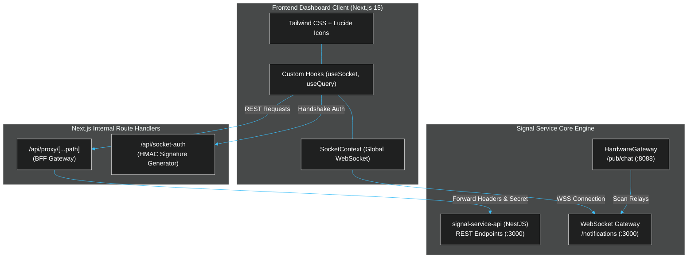

# Signal Service - Frontend Management Dashboard Guide

This guide details the architecture, configuration, and feature modules of the **Signal Service Dashboard** (`signal-service`), built with Next.js 15, React 19, Tailwind CSS, TanStack Query, and Socket.IO Client.

The dashboard provides a centralized management portal and operational cockpit containing three primary modules:
1. **Real-Time Event Monitoring (`/monitoring`)**: Live WebSocket event inspector, latency diagnostics, room subscription manager, and server-to-server (S2S) test emission console.
2. **Project Management (`/project`)**: Multi-tenant project administration, HMAC secret key generation/rotation, webhook routing, and lifecycle status control.
3. **Hardware Device Management (`/device`)**: Biometric/RFID terminal registration, serial number mapping, Redis routing configuration, and verification endpoints.

---

## 1. System Architecture & Tech Stack



### Core Technologies
- **Framework**: Next.js 15 (App Router) & React 19
- **State Management & Data Fetching**: TanStack React Query v5
- **Real-Time Layer**: Socket.IO Client v4.8 (`/notifications` namespace)
- **Styling**: Tailwind CSS, Lucide React icons, and Sonner notifications
- **Security & Proxying**: Next.js Server Route Handlers (`/api/proxy/[...path]`) protecting backend secrets

---

## 2. Environment Configuration & Setup

### 2.1 `.env` Configuration
Configure the frontend environment in `.env.local` or `.env`:

```env
# Backend API base URL for server-side proxying
SIGNAL_API_URL=http://localhost:3000

# Public or resolved Socket.IO server URL
NEXT_PUBLIC_SOCKET_URL=http://localhost:3000

# Internal JWT / Proxy Secret (if applicable)
INTERNAL_PROXY_SECRET=your_secure_proxy_secret
```

### 2.2 Local Development Commands
```bash
# Install dependencies
pnpm install

# Run development server
pnpm dev

# Build production bundle
pnpm build

# Start production server
pnpm start
```

---

## 3. Module 1: Real-Time Event Monitoring (`/monitoring`)

The **Real-Time Monitoring Module** (`src/components/RealtimeMonitor.tsx`) provides an interactive testing suite and live diagnostic inspector for the entire Signal real-time mesh.

### 3.1 Key Capabilities

1. **Dual Connection Modes**:
   - **App Mode (`mode: 'app'`)**: Connects as an application client using a `projectId` and `projectSecret`. Only receives events sent to subscribed project/app/room channels.
   - **Admin Mode (`mode: 'admin'`)**: Sends an admin authentication handshake (`admin_subscribe`). Subscribes to global system logs, connection counts, and broadcast events across all projects.

2. **Connection Health & Diagnostics**:
   - **Latency (RTT)**: Measured in real-time via WebSocket ping/pong intervals. Color-coded for instant health status:
     - 🟢 `< 100ms`: Optimal
     - 🟡 `100ms – 300ms`: Moderate Latency
     - 🔴 `> 300ms`: High Latency / Congested
   - **Connected Clients Counter**: Displays live count of active WebSocket connections.
   - **Auto-Reconnect Control**: Configurable auto-reconnection toggle with exponential backoff and disconnect reason tracking (`lastDisconnectReason`).

3. **Channel & Room Subscription Manager**:
   - Allows operators to join and leave specific room channels dynamically:
     - Project ID: `project_{id}`
     - App ID: `8AE496F4C88EB477...`
     - Channel / Room: `invoices`, `attendance`, `tasks`
   - Emits `join_room` or `leave_room` and maintains an active badges list of joined channels.

4. **S2S REST Dispatch Console (Test Emit)**:
   - Directly triggers HTTP POST `/notifications/emit` through the API proxy to test backend broadcasts without writing external code.
   - Supports 5 target scopes:
     - **Broadcast**: Dispatches globally across all projects.
     - **Project**: Targets `project:{projectId}`.
     - **App**: Targets `project:{projectId}:app:{appId}`.
     - **Room**: Targets `project:{projectId}:app:{appId}:room:{roomId}`.
     - **User**: Targets `user:{projectId}:{appId}:{userId}`.

5. **Live Inspector Tabs**:
   - **Client Events Tab**: Real-time stream of incoming socket events received by the dashboard.
   - **Emit Logs Tab**: History of dispatched test events with server responses.
   - **System Logs Tab**: Internal Socket.io connection state changes, reconnect attempts, and heartbeat messages.

### 3.2 Core Hook: `useSocket` (`src/hook/useSocket.ts`)

```typescript
export interface ConnectSocketParams {
  appId: string;
  secret: string;
  mode: "app" | "admin";
}

export function useSocket() {
  const {
    socket,
    isConnected,
    adminSubscribed,
    connectSocket,
    disconnectSocket,
    toggleAdmin,
    logs,
    clearLogs,
    clientEvents,
    emitLogs,
    connectedClientCount,
    latency,
    autoReconnect,
    toggleAutoReconnect,
    lastDisconnectReason,
    reconnectAttempt,
  } = useSocket();
  // ...
}
```

---

## 4. Module 2: Project Management (`/project`)

The **Project Management Module** (`src/components/ProjectManagement/`) manages multi-tenant isolation, project security credentials, and webhook destinations.

### 4.1 Data Model (`Project`)

```typescript
export interface Project {
  id: string;             // Internal UUID (e.g., "550e8400-e29b-41d4-a716-446655440000")
  project_id: string;     // Unique public project identifier (e.g., "project_e4de70df23a96fdb")
  name: string;           // Human-readable project name
  description: string | null;
  webhook_url: string | null; // URL for async event webhooks
  is_active: boolean;     // Status toggle (active/inactive)
  secret_key?: string;    // HMAC-SHA256 Shared Secret (masked in list view)
  created_at: string;
  updated_at: string;
}
```

### 4.2 Key Features & Operations

1. **Paginated Project List (`listProject`)**:
   - Search by project name or `project_id`.
   - Filter by status (`is_active: true/false`).
   - Offset pagination with configurable limits (10, 25, 50).

2. **Project Creation Modal (`ProjectModal`)**:
   - Form fields: `name`, `description`, `webhook_url`.
   - On submit, `signal-service-api` automatically generates a secure random `project_id` and a 64-character hex `secret_key`.

3. **HMAC Secret Key Viewer (`SecretModal`)**:
   - Safely exposes the unmasked `secret_key` with a one-click copy button.
   - Highlights that this key must match `SIGNAL_SECRET` in the Laravel `.env`.

4. **Secret Key Regeneration (`RegenerateSecretModal`)**:
   - Requires explicit confirmation with a high-visibility warning.
   - **Important**: Regenerating the secret immediately invalidates all active client authentication tickets and backend signatures until applications update their configuration.

5. **Project Activation & Deletion**:
   - **Enable / Disable**: Toggle `is_active` without deleting data. Inactive projects are rejected by `HmacAuthGuard`.
   - **Delete Project**: Soft or permanent removal guarded by an `AlertDialog` confirmation prompt.

---

## 5. Module 3: Hardware Device Management (`/device`)

The **Device Management Module** (`src/components/DeviceManagement/`) configures physical biometric, RFID, and facial recognition terminals (e.g. AiFace terminals) connecting over port `8088`.

### 5.1 Data Model (`Device`)

```typescript
export interface Device {
  id: number;             // Internal numeric identifier
  device_name: string;    // Descriptive label (e.g. "Main Campus Gate A")
  device_id: number;      // Numeric terminal ID
  device_serial: string;  // Unique Hardware Serial Number (sn, e.g. "AF8923019283")
  project_id: string;     // Target Project Scope
  app_id: string;         // Target Application Scope
  room: string;           // Target Room/Channel (e.g. "attendance_kiosk_gate1")
  event: string;          // Real-time Event Name emitted (e.g. "student_scanned")
  webhook: string;        // Fallback verification webhook URL
  created_at?: string;
  updated_at?: string;
}
```

### 5.2 Key Features & Operations

1. **Terminal Registration (`DeviceModal`)**:
   - Associates physical hardware `device_serial` (`sn`) with the Redis routing destination `{ projectId, appId, room, event }`.
   - Configures the verification `webhook` destination (e.g., Laravel's `/api/student/attendance/access-scan`).

2. **Device Routing Table**:
   - Displays all registered terminals with active project, app, and room assignments.
   - Searchable by device serial number or name.

3. **Edit & Reconfiguration**:
   - Update target rooms or event names dynamically without needing to touch or restart physical hardware devices.
   - Redis routing cache is updated immediately on save.

4. **De-registration / Deletion**:
   - Safely remove unused terminals. Once removed, incoming packets from that serial number are rejected by the `HardwareGateway`.

---

## 6. Internal API & BFF Architecture

To prevent exposing backend secrets and internal network topology to client browsers, the frontend utilizes an internal **Backend-For-Frontend (BFF)** proxy pattern.

```
+------------------+         +-------------------------------+         +-----------------------+
|  Browser Client  | ------> | Next.js API Proxy             | ------> | signal-service-api    |
|  (React UI)      |         | /api/proxy/[...path]          |         | (Port 3000 / Internal)|
+------------------+         +-------------------------------+         +-----------------------+
```

### API Proxy Configuration (`src/config/api.ts`)
All API calls from React components use the `apiClient` wrapper, which prefixes requests with `/api/proxy/`:

```typescript
const INTERNAL_API_BASE = "/api/proxy";

export const API_ENDPOINTS = {
  auth: {
    login: "/api/proxy/auth/login",
    logout: "/api/proxy/auth/logout",
    refresh: "/api/proxy/auth/refresh",
  },
  project: {
    listProject: "/api/proxy/projects/list",
    createProject: "/api/proxy/projects/create",
    regenerateSecret: (id: string) => `/api/proxy/projects/regenerate-secret/${id}`,
    updateProject: (id: string) => `/api/proxy/projects/update/${id}`,
    enableProject: (id: string) => `/api/proxy/projects/enable/${id}`,
    disableProject: (id: string) => `/api/proxy/projects/disable/${id}`,
    deleteProject: (id: string) => `/api/proxy/projects/delete/${id}`,
  },
  device: {
    listDevices: "/api/proxy/devices/list",
    createDevice: "/api/proxy/devices/create",
    updateDevice: (id: string) => `/api/proxy/devices/update/${id}`,
    deleteDevice: (id: string) => `/api/proxy/devices/delete/${id}`,
  },
} as const;
```

---

## 7. Summary Reference Table

| Module | Route | Primary Component | Key Actions | Target Backend API |
|---|---|---|---|---|
| **Monitoring** | `/monitoring` | `RealtimeMonitor.tsx` | Connect (App/Admin), RTT Latency, Channel Join, S2S Test Emit, Live Event Inspector | `WS /notifications`<br>`POST /notifications/emit` |
| **Projects** | `/project` | `ProjectManagement.tsx` | List, Search, Create, Edit, Toggle Active, Reveal Secret, Regenerate Secret, Delete | `POST /projects/list`<br>`POST /projects/create`<br>`POST /projects/regenerate-secret/:id` |
| **Devices** | `/device` | `DeviceManagement.tsx` | Register Terminal, Map Serial (`sn`), Configure Room & Event Route, Update, Delete | `POST /devices/list`<br>`POST /devices/create`<br>`PUT /devices/update/:id` |
