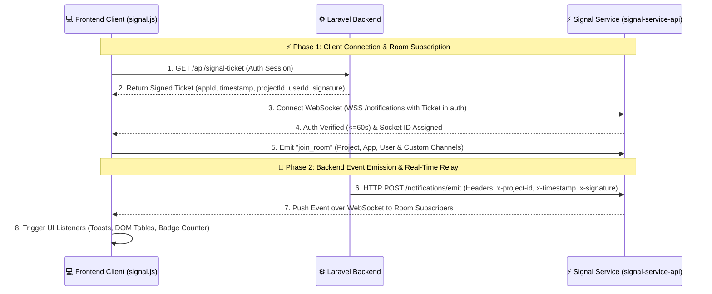

# Signal Service - Laravel Integration Guide

## 1. Introduction

Signal Service is a centralized real-time messaging and notification system designed to deliver instant updates and notifications between backend services and client applications.

This guide provides a step-by-step walkthrough for integrating **Signal Service** into a **Laravel** application. Through this integration, your Laravel backend can securely emit real-time events and notifications, while your client applications can subscribe and react to real-time events instantly.

### Architecture Overview

### Architecture & Lifecycle Flow

The architecture operates in two distinct, sequential phases: **Client Connection & Room Subscription**, followed by **Backend Event Emission & Real-Time Relay**.



### End-to-End Flow Summary Table

#### ⚡ Phase 1: Client Connection & Room Subscription
| Step | Actor | Action | Payload / Target | Description |
| :---: | :--- | :--- | :--- | :--- |
| **1** | Frontend | `GET /api/signal-ticket` | Laravel Session | Requests temporary signed authentication credentials |
| **2** | Laravel | Return Signed Ticket | `{ appId, timestamp, projectId, userId, signature }` | Computes HMAC-SHA256 signature using `SIGNAL_SECRET` |
| **3** | Frontend | Connect WebSocket | `io(url, { auth: ticket, transports: ['websocket'] })` | Establishes persistent connection to `/notifications` namespace |
| **4** | Signal | Verify Signature | Gateway Verification | Validates HMAC signature & clock freshness ($\le$ 60s); joins user room |
| **5** | Frontend | `socket.emit('join_room')` | Project, App, User & Custom Rooms | Subscribes socket to target broadcast channels |

#### 📡 Phase 2: Backend Event Emission & Real-Time Relay
| Step | Actor | Action | Endpoint / Protocol | Description |
| :---: | :--- | :--- | :--- | :--- |
| **6** | Laravel | Trigger Event | `SignalService::taskEmit()` or `eventEmit()` | Application initiates real-time progress or state change |
| **7** | Laravel | HMAC Sign & HTTP POST | `POST /notifications/emit` | Attaches `x-project-id`, `x-timestamp`, `x-signature` headers |
| **8** | Signal | `HmacAuthGuard` Verify | Guard Inspection | Validates timestamp ($\le$ 60s) and HMAC-SHA256 signature |
| **9** | Signal | WebSocket Push | `server.to(room).emit(event, data)` | Broadcasts to subscribers (excluding originator if `self_emit: false`) |
| **10** | Frontend | UI Re-render | `Signal.addListener(event, room, cb)` | Updates DOM tables, progress toasts, badges in real-time |

---

## 2. Detailed Structure of Signal Integration

The Signal integration is composed of three interconnected layers: the **Frontend Client Layer**, the **Laravel Backend Integration**, and the **Signal Service Engine**.

```mermaid
flowchart TD
    subgraph Frontend ["1. Frontend Client Layer (signal.js)"]
        UI["Client Browser UI"]
        SM["SignalManager Singleton"]
        UI --- SM
    end

    subgraph Laravel ["2. Laravel Backend Layer"]
        TicketRoute["/api/signal-ticket<br/>(HMAC Ticket Issuer)"]
        AppLogic["Laravel App Action<br/>(Controller / Job)"]
        SignalSvc["SignalService Wrapper"]
        AppLogic --> SignalSvc
    end

    subgraph SignalEngine ["3. Signal Service (signal-service-api)"]
        WSGateway["WebSocket Gateway<br/>/notifications"]
        HmacGuard["HmacAuthGuard API<br/>POST /notifications/emit"]
        RelayEngine["Room & Broadcaster Engine"]
        WSGateway --- RelayEngine
        HmacGuard --> RelayEngine
    end

    SM -->|1. GET /api/signal-ticket| TicketRoute
    TicketRoute -->|2. Return Signed Ticket| SM
    SM -->|3. Connect WebSocket (Ticket Auth)| WSGateway
    SM -->|4. Emit join_room| WSGateway
    SignalSvc -->|5. HTTP POST (HMAC Signed)| HmacGuard
    RelayEngine -->|6. Real-Time Push| SM
    SM -->|7. UI Updates / Toasts / Badges| UI
```


### 2.1 Component Breakdown

#### A. Signal Service Server (`signal-service-api`)

- **WebSocket Gateway**: Operates on a dedicated namespace (`/notifications`), managing long-lived WebSocket connections with clients.
- **HMAC Verification Engine**: Validates client connection tickets and backend HTTP emit requests against the shared secret.
- **Room Engine**: Routes messages based on project, application, user, or dynamic custom rooms.

#### B. Laravel Backend Service Layer

- **Configuration (`config/signal.php`)**:
  Holds the connection parameters (`SIGNAL_URL`, `SIGNAL_PROJECT_ID`, `SIGNAL_SECRET`).
- **SignalService (`App\Services\SignalService`)**:
  - Implements the HTTP client to communicate with the Signal API.
  - Computes request signatures (`x-project-id`, `x-timestamp`, `x-signature`) using HMAC-SHA256.
  - Exposes helper methods:
    - `eventEmit(...)`: Emit real-time broadcasts or target-specific notifications.
    - `taskEmit(...)`: Emit background task status/progress updates.
    - `getServiceStatus(...)`: Non-blocking health-check with caching.
- **Ticket Issuer Route (`/api/signal-ticket`)**:
  Generates a short-lived, signed ticket for the authenticated user to establish a WebSocket session with the Signal Service.

#### C. Frontend Client Layer (`signal.js`)

- **SignalManager Singleton**:
  - Automatically fetches tickets from Laravel's `/api/signal-ticket`.
  - Connects to the Signal server using Socket.io (`transports: ['websocket']`).
  - Manages room subscriptions (`syncRooms`).
  - Listens for core events (progress indicators, notification counters, broadcast alerts).

---

### 2.2 Data Contract & Protocol Structure

#### 1. Authentication Ticket Structure (Client to Signal Handshake)

When the frontend connects to the Signal server, it submits authentication credentials in the Socket.IO handshake auth object:

```json
{
  "app_id": "8AE496F4C88EB47721B5B202EBDBC546",
  "timestamp": "1726308000",
  "project_id": "YOUR_PROJECT_ID",
  "user_id": "142",
  "signature": "c8b4a2e5d7... (HMAC-SHA256 of appId.timestamp.projectId.userId)"
}
```

#### 2. Backend Emit Payload Structure (Laravel to Signal)

When Laravel triggers an event via `SignalService::eventEmit()` or `taskEmit()`, it sends:

| Field              | Type            | Required | Description                                             |
| ------------------ | --------------- | -------- | ------------------------------------------------------- |
| `project_id`       | `string`        | Yes      | Target project identifier                               |
| `app_id`           | `string`        | Optional | Target application ID                                   |
| `user_id`          | `string`        | Optional | Specific target user ID                                 |
| `room`             | `string`        | Optional | Dynamic room/channel name                               |
| `event`            | `string`        | Yes      | Event name (e.g., `term_promoting`, `approval_updated`) |
| `payload`          | `array\|object` | Yes      | Event payload data                                      |
| `self_emit`        | `bool`          | Optional | Whether to reflect back to sender socket                |
| `sender_socket_id` | `string`        | Optional | Socket ID of the user initiating the action             |

#### 3. Backend Header Security Signature

All HTTP requests from Laravel to Signal Service include:

- `x-project-id`: The configured project ID.
- `x-timestamp`: Unix timestamp string.
- `x-signature`: HMAC-SHA256 hash of `"{projectId}.{timestamp}"` with `SIGNAL_SECRET`.

> [!WARNING]
> **Strict 60-Second Timestamp Window (`MAX_CLOCK_SKEW_SECONDS = 60`)**:
> The `signal-service-api` enforces a maximum clock skew of 60 seconds (`isTimestampFresh()`) on both HTTP requests (`HmacAuthGuard`) and WebSocket ticket handshakes (`NotificationsGateway`). Ensure that server clocks on both Laravel and Signal are synchronized via NTP to prevent `Stale or invalid timestamp` authentication rejections.

---

### 2.3 Room Hierarchy, Naming Conventions & Routing Precedence

The `signal-service-api` maintains structured, namespaced rooms internally to route events accurately:

#### Internal Room Formats

| Scope             | Internal Room Name in Signal Gateway                              | Joined By                                 |
| ----------------- | ----------------------------------------------------------------- | ----------------------------------------- |
| **Project Scope** | `project:{projectId}`                                             | All apps and users in the project         |
| **App Scope**     | `project:{projectId}:app:{appId}`                                 | Specific app clients (e.g. Formal, Tutor) |
| **Custom Room**   | `project:{projectId}:app:{appId}:room:{roomId}`                   | Sockets joining via `join_room`           |
| **User Channel**  | `user:{projectId}:{appId}:{userId}` & `user:{projectId}:{userId}` | User-scoped private notifications         |

#### Routing Precedence in `NotificationsService.sendMessage`

When Laravel posts a message to `/notifications/emit`, the Signal Service resolves the recipient target using the following waterfall precedence:

1. **Target User**: If `user_id`, `app_id`, and `project_id` are provided $\rightarrow$ Emits to room `user:{projectId}:{appId}:{userId}`.
2. **Target Custom Room**: If `room`, `app_id`, and `project_id` are provided $\rightarrow$ Emits to room `project:{projectId}:app:{appId}:room:{roomId}`.
3. **Target App**: If `app_id` and `project_id` are provided $\rightarrow$ Emits to room `project:{projectId}:app:{appId}`.
4. **Target Project**: If `project_id` is provided $\rightarrow$ Emits to room `project:{projectId}`.
5. **Broadcast**: If none of the above are specified $\rightarrow$ Emits to all active sockets connected to the gateway.

#### Self-Emit & Sender Exclusion

- If `self_emit: false` and `sender_socket_id` is passed, the Signal server uses `server.to(room).except(senderSocketId)` to prevent reflecting events back to the initiating user.
- If `self_emit: true` and `sender_socket_id` is passed with no other targets, it targets `server.to(senderSocketId)` exclusively.

---

## 3. Laravel Backend Configuration & Implementation

This section details how to configure Laravel to communicate with Signal Service, implement the service wrapper, generate client tickets, and trigger real-time events.

### 3.1 Environment Configuration (`.env`)

Add the Signal Service environment variables to your `.env` file:

```dotenv
# Signal Service Configuration
SIGNAL_URL=https://your-signal-server.example.com
SIGNAL_PROJECT_ID=YOUR_SIGNAL_PROJECT_ID
SIGNAL_SECRET=YOUR_SIGNAL_SECRET_KEY
```

> [!NOTE]
> `SIGNAL_SECRET` must be identical on both the Laravel application and the `signal-service-api` instance to ensure HMAC signatures match.

---

### 3.2 Signal Config File (`config/signal.php`)

Create `config/signal.php` to expose configuration options across the Laravel framework:

```php
<?php

return [
    'signal_project_id' => env('SIGNAL_PROJECT_ID'),
    'signal_url'        => env('SIGNAL_URL'),
    'signal_secret'     => env('SIGNAL_SECRET'),
];
```

---

### 3.3 Core Service: `SignalService.php` (`app/Services/SignalService.php`)

`SignalService` handles HMAC authentication, HTTP transport, status health-checking, and event publishing.

```php
<?php

namespace App\Services;

use Illuminate\Support\Facades\Http;
use Illuminate\Support\Facades\Log;
use Illuminate\Support\Facades\Cache;
use Throwable;

enum EmitTarget: string
{
    case ALL = 'all';
    case SOMEONE = 'someone';
    case SELF_EXCEPT = 'self_except';
}

enum EmitType: string
{
    case REALTIME = 'realtime';
    case NOTIFY = 'notify';
}

class SignalService
{
    private static string $baseUrl;
    private static string $projectId;
    private static string $secret;

    private static function init(): void
    {
        if (isset(self::$projectId)) {
            return;
        }

        self::$baseUrl   = config('signal.signal_url') ?? '';
        self::$projectId = config('signal.signal_project_id') ?? '';
        self::$secret    = config('signal.signal_secret') ?? '';
    }

    /**
     * Generate HMAC-SHA256 signature for API requests.
     */
    private static function sign(string $timestamp, string $rawBody): string
    {
        return hash_hmac(
            'sha256',
            self::$projectId . "." . $timestamp,
            self::$secret
        );
    }

    /**
     * Send GET request to Signal Service with signature headers.
     */
    public static function get(string $path, array $query = [], int $timeout = 5): array
    {
        self::init();
        $timestamp = (string) time();

        $response = Http::timeout($timeout)
            ->withHeaders([
                'x-project-id' => self::$projectId,
                'x-timestamp'  => $timestamp,
                'x-signature'  => self::sign($timestamp, ''),
            ])->get(self::$baseUrl . "/notifications/{$path}", $query);

        return $response->json() ?? [];
    }

    /**
     * Send POST request with JSON payload to Signal Service.
     */
    public static function post(string $path, array $body): array
    {
        self::init();

        $timestamp = (string) time();
        $rawBody   = json_encode($body);

        $response = Http::withHeaders([
            'x-project-id' => self::$projectId,
            'x-timestamp'  => $timestamp,
            'x-signature'  => self::sign($timestamp, $rawBody),
            'Content-Type' => 'application/json',
        ])
            ->withBody($rawBody, 'application/json')
            ->post(self::$baseUrl . "/notifications/{$path}");

        return $response->json() ?? [];
    }

    /**
     * Non-blocking status check with strict timeout, caching, and fallback error handling.
     */
    public static function getServiceStatus(int $ttlSeconds = 30): array
    {
        return Cache::remember('signal_service_status', $ttlSeconds, function () {
            try {
                $status = self::get('status', [], timeout: 2);

                return [
                    'status_code' => 200,
                    'status'      => true,
                    'data'        => $status,
                ];
            } catch (Throwable $e) {
                Log::warning('SignalService status check failed: ' . $e->getMessage());

                return [
                    'status_code' => 503,
                    'status'      => false,
                    'data'        => [
                        'error' => 'Service unreachable',
                    ],
                ];
            }
        });
    }

    /**
     * Emit background task progress updates (used in queued jobs).
     */
    public static function taskEmit(
        string $event,
        array $payload,
        string $socketId = null,
        string $user_class = null,
        ?string $userId = null,
        ?string $room = null,
        ?bool $selfEmit = false,
    ): array {
        if (!$socketId) {
            return [];
        }
        self::init();

        $data = array_filter([
            'project_id'       => self::$projectId,
            'app_id'           => function_exists('getAppIdByUserClass') ? getAppIdByUserClass($user_class) : null,
            'user_id'          => $userId,
            'room'             => $room,
            'event'            => $event,
            'payload'          => $payload,
            'sender_socket_id' => $socketId,
            'self_emit'        => $selfEmit,
        ], fn($value) => $value !== null);

        return self::post('emit', $data);
    }

    /**
     * Emit general events or targeted notifications to clients.
     */
    public static function eventEmit(
        string $event,
        array $payload,
        EmitTarget|string $target = EmitTarget::ALL,
        EmitType|string $type = EmitType::REALTIME,
        ?string $appId = null,
        ?string $userId = null,
        ?string $room = null,
    ): array {
        self::init();

        Log::info("[Signal] Emitting: " . self::$projectId . " {$event} " . json_encode($payload));

        $data = array_filter([
            'project_id' => self::$projectId,
            'app_id'     => $appId,
            'user_id'    => $userId,
            'room'       => $room,
            'event'      => $event,
            'payload'    => $payload,
            'self_emit'  => $target !== EmitTarget::SELF_EXCEPT,
        ], fn($value) => $value !== null);

        return self::post('emit', $data);
    }
}
```

---

### 3.4 Client Authentication Ticket Route (`routes/api.php`)

Frontend clients need a valid ticket to establish a WebSocket connection. Laravel issues this ticket signed with the shared secret.

```php
use Illuminate\Http\Request;
use Illuminate\Support\Facades\Route;

Route::middleware('auth.api')->get('/signal-ticket', function (Request $request) {
    $appId     = getAppIdByUserClass($request->user->user_class ?? '');
    $secret    = config('signal.signal_secret');
    $timestamp = (string) time();
    $projectId = config('signal.signal_project_id');
    $userId    = (string) $request->user->id;

    // HMAC signature matching the handshake validator on the Signal server
    $signature = hash_hmac(
        'sha256',
        "{$appId}.{$timestamp}.{$projectId}.{$userId}",
        $secret
    );

    return response()->json(compact('appId', 'timestamp', 'projectId', 'userId', 'signature'));
});
```

---

### 3.5 Implementation Patterns & Real-World Usage

To ensure clean architecture and predictable client handling, Signal differentiates between progressive operations and discrete event broadcasts:

| Method                                                 | Core Purpose                                                                                                           | Typical Use Cases                                                                                                                                                        | Payload Characteristics                                                                    |
| ------------------------------------------------------ | ---------------------------------------------------------------------------------------------------------------------- | ------------------------------------------------------------------------------------------------------------------------------------------------------------------------ | ------------------------------------------------------------------------------------------ |
| **`SignalService::taskEmit()`**                        | **Progressive Operations**: Tracking ongoing, multi-step asynchronous processes with measurable progress.              | • File uploads / downloads<br>• Large data import / export (Excel/CSV)<br>• Bulk background jobs (e.g. student promotion, sync tasks)<br>• Heavy PDF / report generation | Includes `progress_done`, `progress_total`, `progress_percent`, `socket_id`, and `taskId`. |
| **`SignalService::eventEmit()`<br>`[type: notify]`**   | **Persistent Notifications**: Alerts that update notification badges and unread counters.                              | • New invoice received<br>• Approval request assigned<br>• Payment confirmation alert                                                                                    | Includes `type: 'notify'`, item IDs, and notification messages.                            |
| **`SignalService::eventEmit()`<br>`[type: realtime]`** | **Instant State Refresh**: Lightweight broadcasts to dynamically update active screens without creating notifications. | • Live table row update<br>• Real-time record locking<br>• Chat messages or instant status toggles                                                                       | Includes state data payloads without triggering badge counter increments.                  |

---

#### Pattern 1: Long-Running Process Tracking with `taskEmit`

`taskEmit` is specifically designed for ongoing tasks that have incremental stages (such as file downloads, uploads, or queued background jobs). It includes the user's `socket_id` so the client can differentiate the task initiator from other users, and employs server-side throttling (via Cache) to prevent flooding the WebSocket gateway.

```php
namespace App\Jobs;

use Illuminate\Support\Facades\DB;
use Illuminate\Support\Facades\Cache;
use App\Services\SignalService;

class ProcessStudentTermTransfer implements ShouldQueue
{
    public $taskId;
    public $senderSockerID;
    public $ss;

    public function handle()
    {
        // 1. Update task progress atomically
        DB::table('sync_tasks')->where('id', $this->taskId)->update([
            'progress_done' => DB::raw('progress_done + 1')
        ]);

        $task = DB::table('sync_tasks')->where('id', $this->taskId)->first();
        $percent = ($task && $task->progress_total > 0)
            ? round(($task->progress_done / $task->progress_total) * 100, 2)
            : 0;

        DB::table('sync_tasks')->where('id', $this->taskId)->update([
            'progress_percent' => $percent,
            'updated_at'       => now()
        ]);

        // 2. Throttle WebSocket emission to at most once every 2 seconds
        $cacheKey = "task_last_emit_{$this->taskId}";
        $currentTime = microtime(true);
        $lastEmitTime = Cache::get($cacheKey, 0);

        if ($currentTime - $lastEmitTime >= 2) {
            Cache::put($cacheKey, $currentTime, 5);

            SignalService::taskEmit(
                event: 'term_promoting',
                payload: [
                    'progress_total'   => $task->progress_total ?? 0,
                    'progress_done'    => $task->progress_done ?? 0,
                    'progress_percent' => $percent,
                    'socket_id'        => $this->senderSockerID,
                ],
                user_class: $this->ss->user_class ?? null,
                socketId:   $this->senderSockerID,
            );
        }
    }
}
```

---

#### Pattern 2: In-App Notifications with `eventEmit` (`type: notify`)

When an action requires creating or updating an in-app notification badge / notification list (e.g. an invoice is received):

```php
use App\Services\SignalService;

SignalService::eventEmit(
    event: 'invoice_received',
    payload: [
        'invoice_id' => $data->invoice_id,
        'receipt_id' => $data->receipt_id,
        'message'    => $data->message,
        'type'       => 'notify',
    ],
);
```

> **Frontend Behavior**: The client increments unread badge counts (`#_main_notif_count`) and renders a notification card or toast.

---

#### Pattern 3: Real-Time Live State Update with `eventEmit` (`type: realtime`)

When an event only needs to trigger an immediate state refresh or UI update on active client screens without creating a persistent notification:

```php
use App\Services\SignalService;

SignalService::eventEmit(
    event: 'received',
    payload: [
        'invoice_id' => $invoice_id,
        'receipt_id' => $receipt_id,
        'message'    => 'Successfully received invoice',
    ],
);
```

> **Frontend Behavior**: The client listens directly for the `'received'` event and updates the active table or view dynamically without requiring a page reload.

---

## 4. Frontend Client Integration

This section details how to configure and initialize Signal on the client side, organize script loading order, register global application events, and dynamically bind events inside individual page components.

### 4.1 Blade Layout Setup (`*.main.php` / `formal.blade.php`)

In your main Blade layout (such as `formal.blade.php` or `main.blade.php`), configure the required metadata, inject backend environment parameters into `window.APP_CONFIG`, and bundle your JavaScript assets.

#### 1. Required Meta Tags

Signal requires `app_id` and `sess_user_id` to construct default room subscriptions and fetch valid authentication tickets:

```html
<head>
  <!-- Application Identifiers for Signal -->
  <meta name="app_id" content="{{ sess_app_id('formal') }}" />
  <meta name="sess_user_id" content="{{ sess_user_id() }}" />
  <meta name="base_url" content="{{ url('/') }}" />

  <!-- Inject Signal Environment Variables into Window Object -->
  <script>
    window.APP_CONFIG = {
      socketUrl: "{{ config('signal.signal_url') }}",
      projectId: "{{ config('signal.signal_project_id') }}",
    };
  </script>
</head>
```

#### 2. Script Bundling via `script_bundles.php` & Loading Order

In this architecture, scripts are bundled through `script_bundles.php` and managed using `ScriptManager::render(...)`.

> [!IMPORTANT]
> **Always place `signal.js` at the very end of the `files` array inside your component bundle.**
>
> If `signal.js` executes before your application components, UI dialogs, and DOM handlers are loaded, any real-time events triggered upon connection (such as notification toasts, unread badges, or task progress listeners) will attempt to interact with missing component objects and crash with undefined errors.

##### Bundle Configuration (`script_bundles.php`)

In `script_bundles.php`, include the Socket.IO client library towards the top, followed by all UI components, and append `signal.js` as the **last file** in the bundle:

```php
// config/script_bundles.php
return [
    'formal-components' => [
        'attr'        => 'defer',
        'single_file' => 1,
        'output_file' => '/dist/js/ksm.components.js?v=8',
        'files'       => [
            // 1. Router & Real-Time Client Dependencies
            'https://cdn.vectoraclouds.com/vsel/router/router.shell.js',
            'https://cdn.socket.io/4.8.1/socket.io.min.js',

            // 2. Base layout script
            '/js/layout/formal/main.js',

            // 3. UI Components & Dialogs (Loaded first)
            '/js/components/formal/RenderTableReport.js',
            '/js/components/formal/PDFReport.js',
            '/js/components/formal/DashboardComponent.js',
            '/js/components/formal/InvoicesComponent.js',
            '/js/components/formal/ClassAttendanceComponent.js',
            '/js/components/formal/GraduatedComponent.js',

            // 4. Signal Client Hub (MUST BE AT THE VERY END)
            '/js/signal.js',
        ]
    ],
];
```

##### Blade Layout Rendering (`formal.blade.php`)

In your Blade layout (`formal.blade.php`), the entire bundle is compiled and injected cleanly via `ScriptManager`:

```php
<head>
    <?php
    // Renders the base utilities and dependencies
    ScriptManager::render('formal-base', 1, 47);

    // Renders all components with signal.js placed at the end
    ScriptManager::render('formal-components', 1, 425);
    ?>
</head>
```

---

### 4.2 Signal Initialization in `main.js`

In `main.js`, initialize `window.Signal` inside the `DOMContentLoaded` event listener. Adding a small timeout (e.g., 1000–2000ms) allows heavy initial page rendering to settle before opening the WebSocket stream:

```javascript
// main.js
document.addEventListener("DOMContentLoaded", async () => {
  if (window.Signal) {
    setTimeout(() => {
      // Parameters: userRooms = [], userEvents = [], isScan = false
      window.Signal.init(null, null, false);
    }, 2000);
  }
});
```

When `init()` runs, it performs the following sequence:

1. Refreshes current pending notification and approval counts via API.
2. Resolves default rooms (`projectId`, `appId`, `userId`).
3. Calls `/api/signal-ticket` to obtain an HMAC authentication ticket.
4. Establishes a Socket.IO connection to `${SOCKET_URL}/notifications` via WebSockets.
5. Invokes `bindDefaultEvents()` to attach global listeners.

---

### 4.3 Centralized Hub: Global Events in `bindDefaultEvents()` (`signal.js`)

`signal.js` serves as the central orchestration hub for all application-level events. Common app-wide events are declared inside `bindDefaultEvents()`:

```javascript
// Inside signal.js -> SignalManager.bindDefaultEvents()
async bindDefaultEvents() {
    logger.log("[Signal Debug] Registering default application listeners...");

    // 1. Long-running process progress listener (e.g. term promoting, file downloads, batch imports)
    await this.addListener("term_promoting", null, (rawPayload) => {
        const payload = typeof rawPayload === "string" ? JSON.parse(rawPayload) : rawPayload;
        const done    = Number(payload?.progress_done ?? 0);
        const total   = Number(payload?.progress_total ?? 0);
        const percent = payload?.progress_percent !== undefined
            ? Number(payload.progress_percent)
            : (total > 0 ? Math.round((done / total) * 100) : 0);

        const currentSocketId = window.socket?.id;
        const isOwner = payload?.socket_id && currentSocketId
            ? payload.socket_id === currentSocketId
            : true;

        // Render SweetAlert toast/progress bar for non-initiators or all users
        if (!isOwner && percent < 100) {
            Swal.fire({
                toast: true,
                position: "top-end",
                icon: "info",
                showConfirmButton: false,
                html: `
                    <div style="font-size: 13px; font-weight: 500;">
                        <span>Progress:</span>
                        <b style="color: #2563eb;">${percent}%</b>
                        <span style="color: #64748b;">(${done}/${total})</span>
                    </div>
                `
            });
        }
    });

    // 2. Global notification badge updater
    await this.addListener("invoice_received", null, (payload) => {
        if (payload?.type === "notify") {
            refreshPendingNotificationCounts(); // Updates #_main_notif_count badge
        }
    });
}
```

---

### 4.4 Using Signal Dynamically in Frontend Components

Individual page components, modals, or views can interact with `window.Signal` at any time after the page loads.

#### 1. Listen for Events Globally or in a Specific Room

Use `addListener` to capture real-time broadcasts in a component:

```javascript
// Inside your component / blade script
if (window.Signal) {
  // Listen to an event globally
  window.Signal.addListener("invoice_status_updated", null, (payload) => {
    console.log("Invoice status changed:", payload);
    myDataTable.reload(); // Refresh table view
  });
}
```

#### 2. Join a Specific Room with a Callback

When entering a specific module (e.g. Invoice #102 or Class #45):

```javascript
// Join a specific room and bind an event in one call
window.Signal.joinRoom("invoice_102", "payment_confirmed", (payload) => {
  Swal.fire("Success", "Payment confirmed for this invoice!", "success");
  reloadInvoiceDetails();
});
```

#### 3. Join a Room with Multiple Event Listeners

```javascript
window.Signal.joinRoomWithListeners("attendance_room", [
  {
    name: "student_checked_in",
    callback: (data) => updateStudentRow(data.student_id, "present"),
  },
  {
    name: "student_absent",
    callback: (data) => updateStudentRow(data.student_id, "absent"),
  },
]);
```

#### 4. Getting Current `socket_id` to Send to Backend

When dispatching a long-running process from the frontend, get the current socket ID and pass it in your API request. The backend can then pass it to `taskEmit(..., socketId: $socketId)`:

```javascript
// Component triggering a batch job or export
async function startTermPromotion() {
  const socketId = await window.Signal.getSocketId();

  fetch("/api/start-term-promotion", {
    method: "POST",
    headers: {
      "Content-Type": "application/json",
      "X-CSRF-TOKEN": document.querySelector('meta[name="csrf-token"]').content,
    },
    body: JSON.stringify({
      academic_year: "2026",
      socket_id: socketId, // Allows backend taskEmit to identify initiator
    }),
  });
}
```

